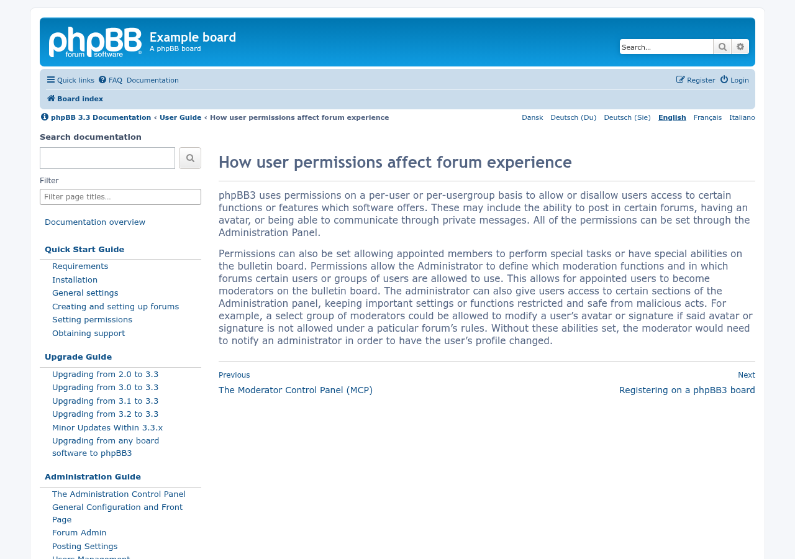
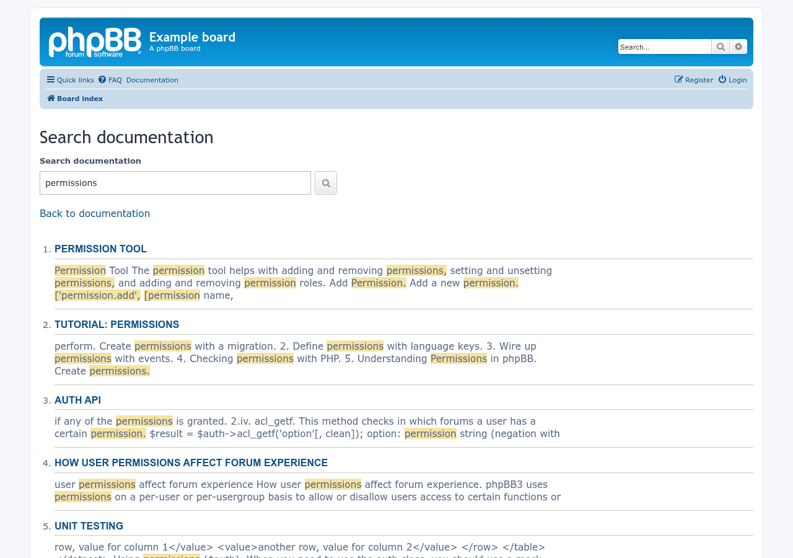
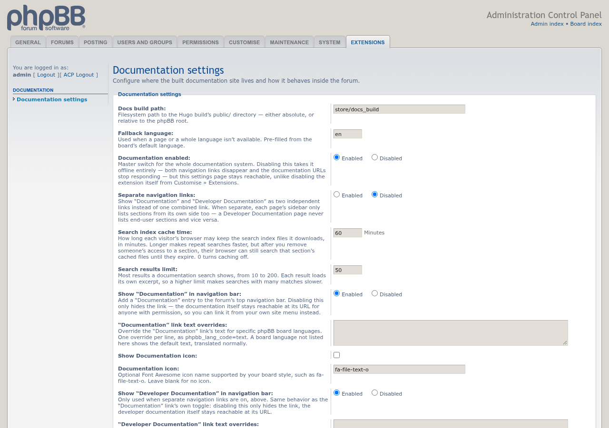

# Documentation

[](https://github.com/phpbbmodders/documentation/actions/workflows/tests.yml) [](https://github.com/phpbbmodders/documentation/actions/workflows/lint.yml)

Shows the board's Hugo documentation site inside phpBB, styled with the active board style.

## Features

- Serves a built Hugo docs site at `/documentation`, wrapped in the board's own style.
- Language picker: automatic (from the user's language) or manual, with fallbacks and language-code overrides.
- Per-section and per-language permissions, open to everyone by default.
- Navigation links in the board header, and **Resync permissions** when new sections or languages are added.

## Screenshots

<table>
  <tr>
    <td align="center"><a href="docs/images/documentation-page.png"></a><br>A documentation page</td>
    <td align="center"><a href="docs/images/documentation-search.png"></a><br>Search results</td>
    <td align="center"><a href="docs/images/documentation-acp-settings.png"></a><br>ACP settings</td>
  </tr>
</table>

Click a screenshot for the full size. More screenshots, including the phone layout and the permissions screen, are on the [Screenshots wiki page](https://github.com/phpbbmodders/documentation/wiki/Screenshots).

## Requirements

- phpBB 3.3.19 or a later 3.3 release
- PHP 8.0 or later

## Installation

1. Copy the extension to `/ext/phpbbmodders/documentation`
2. In the Administration Control Panel, go to **Customise → Manage extensions**
3. Enable the **Documentation** extension
4. Build the documentation into phpBB's `store/docs_build/` directory:
   `./phpbbdocs_hugo.sh all /path/to/phpbb/store/docs_build`
   This is the default **docs build path** in the settings, so no further ACP configuration is needed unless the build lives elsewhere. Keeping it outside the extension's own directory means updating the extension doesn't delete it.
5. Documentation is open to everyone, including guests, by default. Restrict it afterwards through the normal Permissions screens if needed.
6. **Make sure the build can't be read directly from the web.** phpBB's own deny rules for `store/` cover the default location on Apache, LiteSpeed, and servers set up from phpBB's sample configs. Without a deny rule, the raw pages can be read directly, bypassing the extension's permissions. See [docs/securing-docs-build.md](docs/securing-docs-build.md).

The build's HTML is shown inside the board as-is, so only put a build you trust at the docs build path, in a directory only administrators can write to.

Boards upgraded from an earlier version keep their build at an earlier default, `ext/phpbbmodders/documentation/docs-build/` or `store/phpbbmodders_documentation/`, if one was already there; boards with nothing there move to `store/docs_build/`. Move a build kept inside the extension's directory, because the next extension update deletes it; the settings page warns while it is there. If a build is moved but the setting isn't updated, the extension reads it from `store/docs_build/` and the settings page asks for the setting to be updated.

If you add a new top-level section or a new language to the docs build later, use the **Resync permissions** button on the settings page.

### Language code overrides

phpBB and the docs build don't always agree on language codes, regional variants especially (phpBB's `pt_br` vs. a docs build keyed `pt-BR`, for example). Matching codes and broad-language fallbacks are handled automatically; the **Language code overrides** field in the settings covers anything that still doesn't line up.

### External menus

Leave the documentation system enabled and disable both **Show in navigation bar**
settings to hide the built-in links. Documentation remains accessible by URL.
An external Twig menu can use `U_DOCUMENTATION` and `U_DOCUMENTATION_DEVDOCS`,
with `DOCUMENTATION_NAV_TEXT` and `DOCUMENTATION_DEVDOCS_NAV_TEXT` as labels.
These remain available in combined and separate navigation modes, but are empty
when the viewer lacks access, the build is missing, or documentation is offline.
Check the URL before rendering each external menu entry. The
`S_DOCUMENTATION_NAV_VISIBLE` flags control only the built-in navigation.

## Documentation search

**Search documentation** searches titles and page text in the selected language
with [Pagefind](https://pagefind.app/), which runs in the browser. Results
include highlighted excerpts. The ACP's **Search results limit** sets how many
are shown (10-200, default 50). The sidebar **Filter** still filters titles only.

Visitors without JavaScript get server-side results instead: every word must
match, title matches come first, and the same limit applies. The server also
answers when a build has no Pagefind bundles. With JavaScript, the search form
tells the server to skip its own search and leave it to Pagefind.

The phpbbdocs-hugo build writes, for each language and top-level section, a
Pagefind bundle to `<lang>/<section>/pagefind/` and a server-side index to
`<lang>/<section>/search-index.json`. Rebuild with `phpbbdocs_hugo.sh` after
changing content. A build with neither still serves pages, but search reports
that it is unavailable.

The search page checks language and section permissions, searches only the
server-side indexes of sections the user may read, and gives the browser only
those sections' bundles. Bundle files are served through
`/documentation-search-bundle/{lang}/{section}/{path}`, which repeats those
checks for every file. Index files named by content hash may stay in the
browser's private cache for the ACP's **Search index cache time** (default 60
minutes, 0 turns it off), so a user who loses access to a section can still
search what they already downloaded until it expires. Separate navigation limits search to the current
documentation side. Keep raw access to the build directory blocked, including
its Pagefind bundles and search indexes, as described in [docs/securing-docs-build.md](docs/securing-docs-build.md).

`styles/all/template/js/documentation-search.js` is a copy of phpbbdocs-hugo's
`site/static/js/documentation-search.js`; keep the two in sync.

## Tests

Run PHPUnit 9.6 from the extension directory:

```bash
phpunit -c phpunit.xml.dist
```

The bootstrap finds phpBB automatically when the extension is installed at
`ext/phpbbmodders/documentation`. For a standalone checkout, set the path to
a phpBB installation with its Composer dependencies:

```bash
PHPBB_ROOT_PATH=/path/to/phpbb phpunit -c phpunit.xml.dist
```

The tests use temporary fixtures. The purge regression requires PHP's SQLite3
extension and uses an in-memory database.

## TODO

Open documentation checks and archived reviews: [docs/TODO.md](docs/TODO.md).

## Contributing

Contributions are welcome!

- **Bug reports**: [Open an issue](https://github.com/phpbbmodders/documentation/issues).
- **Everything else** (questions, feature requests, ideas, general discussion): [Use Discussions](https://github.com/orgs/phpbbmodders/discussions), or the [community forum](https://www.phpbbmodders.com/community/).
- Pull requests are welcome for bug fixes or discussed features.

## Acknowledgments

- Code review, bug fixes, and documentation assisted by [Claude](https://www.anthropic.com/claude).

## License

This extension is licensed under the **GNU General Public License v2.0**.

See [license.txt](license.txt) for more information.
